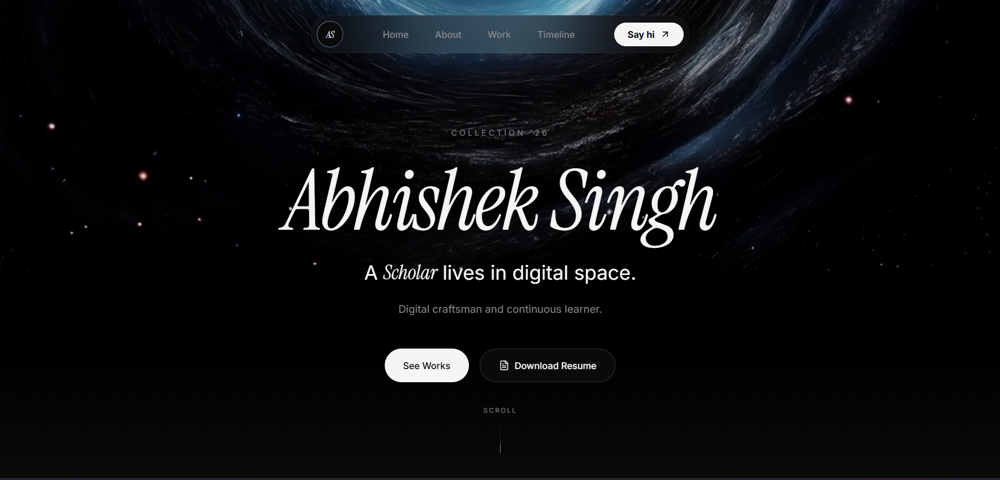

# 🌌 Curiosity-Driven Portfolio: AI & Design Console

A premium, high-performance developer portfolio built for the intersection of **Artificial Intelligence** and **Creative Web Design**. This project features a fully integrated **Admin Control Center** (CMS) that enables dynamic content management directly from the browser, powered by Firebase.

<<<<<<< HEAD

=======

>>>>>>> e6387c9e7ecaab0c5010a78d0337fb95266fe105

## ✨ Core Experience
- **Fluid Motion & Design**: Leverages **Framer Motion**, **GSAP**, and **Lenis** for ultra-smooth scrolling and premium micro-interactions.
- **Interactive Backgrounds**: A custom-built p5.js/Canvas particle engine that responds to user presence.
- **Cyber-Tech Aesthetic**: A dark-mode first design utilizing glassmorphism, HUD overlays, and tonal layering.
- **Dynamic Content Architecture**: All content (Projects, Journey, Skills, Languages, UI Strings) is fetched in real-time from Firestore.
- **Pro Admin Console**: A secure, dashboard-style CMS with:
  - **Skill Density Analytics**: Radar charts visualizing your stack.
  - **Telemetry Dashboard**: Monitoring page views and resume downloads.
  - **Full CMS capabilities**: CRUD operations for projects, experience, and site-wide text strings.

## 🛠️ Technical Architecture
- **Framework**: [React 18](https://reactjs.org/) + [Vite](https://vitejs.dev/)
- **Language**: [TypeScript](https://www.typescriptlang.org/)
- **Styling**: [Tailwind CSS](https://tailwindcss.com/)
- **Database/Auth**: [Firebase](https://firebase.google.com/) (Firestore & Auth)
- **Animations**: Framer Motion, GSAP, Lenis
- **Charts**: Chart.js / React-Chartjs-2
- **Hosting**: Optimized for [Netlify](https://www.netlify.com/)

## 📂 Project Structure
```
Portfolio/
├── src/
│   ├── admin/               # Management Console (CMS)
│   │   ├── components/      # Admin-only UI elements
│   │   ├── views/           # Admin dashboard views
│   │   └── AdminApp.tsx     # Admin entry point
│   ├── components/          # Frontend Portfolio components
│   ├── lib/                 # Core utilities & Firebase config
│   ├── App.tsx              # Main Portfolio entry point
│   └── main.tsx             # React mount point
├── public/                  # Static assets & SEO (robots.txt, _redirects)
├── index.html               # Frontend Entry
├── admin.html               # Admin Entry
├── netlify.toml             # Deployment Configuration
└── vite.config.ts           # Build Configuration
```

## 🚀 Development & Deployment

### Local Setup
1. **Clone & Install**:
   ```bash
   git clone [repository-url]
   cd Portfolio
   npm install
   ```
2. **Start Dev Server**:
   ```bash
   npm run dev
   ```
3. **Build for Production**:
   ```bash
   npm run build
   ```

### Firebase Configuration
1. Create a project in the [Firebase Console](https://console.firebase.google.com/).
2. Enable **Firestore Database** and **Email/Password Authentication**.
3. Update `src/lib/firebase.ts` with your config keys.
4. Set up your collection in Firestore under `portfolio/data`.

### Netlify Deployment
The project includes a `netlify.toml` for zero-config deployment. Simply connect your GitHub repository to Netlify and it will automatically handle the build commands and SPA routing.

## 🔐 Security Note
The admin console (`admin.html`) is protected by Firebase Authentication. Ensure you manually create your admin user in the Firebase Console under the Authentication tab. SEO indexing for the admin console is disabled via `public/robots.txt`.

---
*Developed with a focus on systems architecture and visual excellence.*
